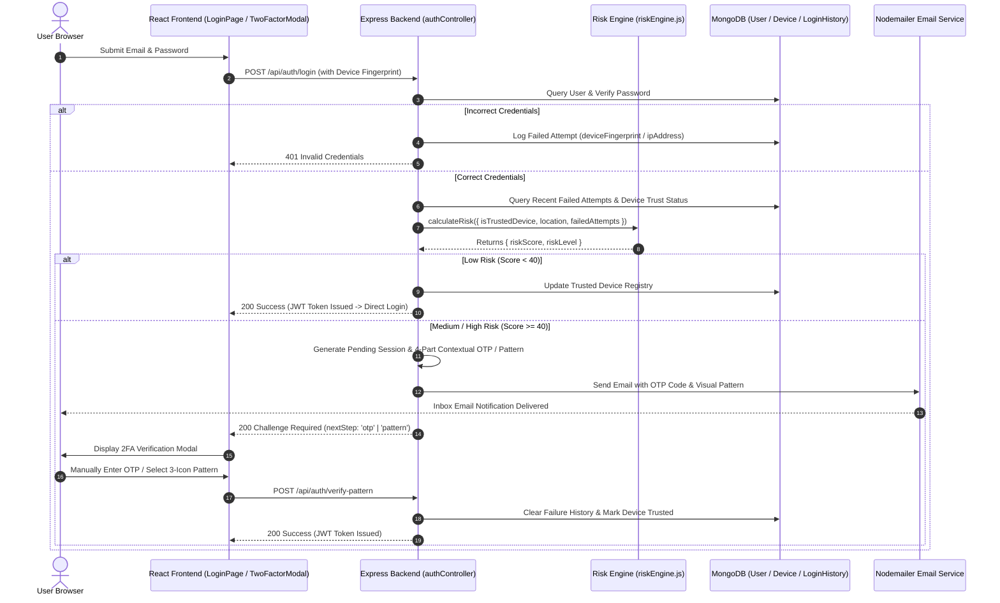

# 🔒 Adaptive Two-Factor Authentication (2FA) System Architecture

This document provides a comprehensive technical walkthrough of how the **Adaptive Risk-Based Two-Factor Authentication (2FA)** system is designed and integrated into the **Traveloop** web application.

---

## 🏛️ 1. High-Level Architecture Overview

The system uses a **Contextual & Adaptive Risk Engine** rather than enforcing static 2FA for every login. It evaluates risk dynamically based on device identity, location anomaly, and recent failed attempt history.

---

## ⚙️ 2. Core Components & Technical Implementation

### A. The Adaptive Risk Assessment Engine ([riskEngine.js](file:///e:/odoo-hackthon-main/odoo-hackthon-main/server/utils/riskEngine.js))
The risk engine evaluates login attempts dynamically using three main security metrics:

1. **First-Try Correct Credentials**: Evaluated as `Risk Score: 0` $\rightarrow$ Grants **Direct Instant Login**.
2. **1 Failed Password/Email Attempt**: Evaluated as `Risk Score: 40` (`MEDIUM Risk`) $\rightarrow$ Triggers **Visual Pattern Selection**.
3. **2+ Failed Password/Email Attempts**: Evaluated as `Risk Score: 75` (`HIGH Risk`) $\rightarrow$ Triggers **Full 2-Stage 2FA** (Contextual OTP FIRST, followed by Visual Pattern).

---

### B. Backend Controller & Session Verification ([authController.js](file:///e:/odoo-hackthon-main/odoo-hackthon-main/server/controllers/authController.js))
* **Device Fingerprinting**: Generates SHA-256 hashes of user browser headers (`browser`, `os`, `screenResolution`, `userAgent`).
* **Failed Attempt Tracking**: Queries `LoginHistory` by `deviceFingerprint` and `userId` over a 15-minute sliding window to detect brute-force attempts across emails or passwords.
* **Pending Auth Tokens**: Issues short-lived JWT pending tokens (`challengeType: 'pattern' | 'otp'`) signed with a 10-minute expiry during step-up challenges.

---

### C. Nodemailer Real Email Service ([emailService.js](file:///e:/odoo-hackthon-main/odoo-hackthon-main/server/utils/emailService.js))
* **Zero Payload Secret Leakage**: Secret passcodes (`otp`) and pattern icon hints are strictly removed from API HTTP responses.
* **Email Delivery**: Sends styled HTML security alerts directly to the user's Gmail/SMTP email address containing:
  * **4-Part Contextual OTP**: Bound to device operating system and IP octet (e.g., `WIN-7X9P-IP01-T88`).
  * **Visual Pattern Sequence**: 3-icon sequence generated from a secure icon pool (`Shield ➔ Eye ➔ Lock`).

---

### D. Frontend User Interface ([LoginPage.jsx](file:///e:/odoo-hackthon-main/odoo-hackthon-main/client/src/pages/LoginPage.jsx) & [TwoFactorModal.jsx](file:///e:/odoo-hackthon-main/odoo-hackthon-main/client/src/components/TwoFactorModal.jsx))
* **Seamless Direct Login**: If the risk level is `low`, the user is logged directly into the Traveloop dashboard without modal interruptions.
* **Step-Up 2FA Modal**: If risk level is elevated, a glassmorphic modal pops up requiring:
  * **Step 1 (OTP Input)**: A text input requiring the user to type the 4-part code read from their email.
  * **Step 2 (Visual Pattern Grid)**: An interactive 3-icon selection grid mapping icons (`Shield`, `Eye`, `Lock`, `Orb`, `Pulse`, `Matrix`).

---

## 🔒 3. Summary of Security Rules

| Login Scenario | Evaluated Risk | Action Taken |
| :--- | :---: | :--- |
| **First-Try Correct Credentials** | **Low Risk (Score 0)** | **Direct Instant Login** (bypasses 2FA for zero friction). |
| **1 Incorrect Attempt** (Wrong Email or Password) | **Medium Risk (Score 40)** | **Step 1: Visual Pattern Selection** (3-icon sequence). |
| **2+ Incorrect Attempts** (Wrong Email or Password) | **High Risk (Score 75)** | **Full 2-Stage 2FA**: Contextual OTP Verification FIRST, followed by Visual Pattern. |
