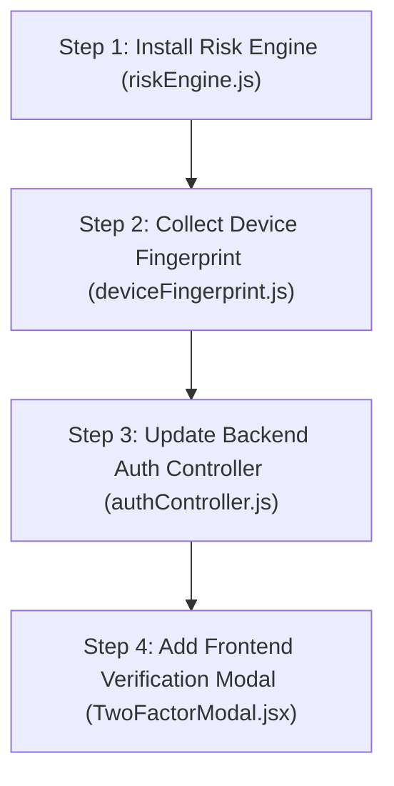

# 🎓 Mentor Presentation Guide: Integrating Adaptive 2FA into Any Web Project

Use this structured guide when explaining or presenting your **Adaptive Two-Factor Authentication (2FA)** system to mentors, evaluators, or project judges.

---

## 🎤 1. Executive Summary (The 30-Second Elevator Pitch)

> *"Standard 2FA prompts users every single time, creating friction. Our system uses an **Adaptive Risk-Based Security Engine**. It evaluates device fingerprinting, location context, and failed attempt history in real-time:*
> 1. **Low Risk** *(Normal Login)*: Direct instant access with zero friction.
> 2. **Medium Risk** *(1 Failed Attempt)*: Requires a **Visual Icon Pattern** sequence.
> 3. **High Risk** *($\ge 2$ Failed Attempts / Attack)*: Enforces **Full 2-Stage 2FA** *(Real Nodemailer OTP Email FIRST, followed by Visual Pattern)*."

---

## 🛠️ 2. The 4-Step Integration Framework for Any Project

To integrate this security system into any MERN/Node.js web application, follow these 4 modular steps:



---

### 🔹 Step 1: Add the Risk Engine (`server/utils/riskEngine.js`)
Create a lightweight risk calculation module that takes user login context and calculates a numerical risk score ($0 - 100$):

```javascript
function calculateRisk({ isTrustedDevice, location, failedAttempts }) {
  let score = 0;
  if (failedAttempts === 1) score += 40;       // Medium Risk -> Visual Pattern
  else if (failedAttempts >= 2) score += 75;   // High Risk   -> Nodemailer OTP + Pattern
  
  const riskLevel = score >= 70 ? 'high' : score >= 40 ? 'medium' : 'low';
  return { riskScore: score, riskLevel };
}
```

---

### 🔹 Step 2: Add Browser Device Fingerprinting (`client/src/utils/deviceFingerprint.js`)
Extract browser headers (OS, browser type, screen resolution) and generate a SHA-256 fingerprint hash to track trusted vs unknown browsers across sessions.

---

### 🔹 Step 3: Update Login & Mail Handler (`server/controllers/authController.js`)
Modify your backend login endpoint to evaluate risk **before** issuing the final JWT authentication token:

```javascript
// 1. Check if prior failed attempts exist on this device fingerprint in last 15 mins
const recentFailures = await LoginHistory.countDocuments({
  deviceFingerprint, status: { $in: ['FAILED_PASSWORD', 'FAILED_EMAIL'] }
});

// 2. Evaluate Risk
const { riskLevel } = calculateRisk({ failedAttempts: recentFailures });

// 3. If Low Risk -> Issue JWT Token immediately!
if (riskLevel === 'low') {
  return res.json({ token: generateToken(user._id) });
}

// 4. If Medium/High Risk -> Send Email via Nodemailer & issue temporary Pending Token!
await sendTwoFactorEmail({ to: user.email, otp, patternSequence });
return res.json({ requiresChallenge: true, pendingToken, nextStep: riskLevel === 'high' ? 'otp' : 'pattern' });
```

---

### 🔹 Step 4: Mount Frontend Step-Up Modal (`client/src/components/TwoFactorModal.jsx`)
In your React/Vue login page, listen for `requiresChallenge === true`. When triggered, render the 2FA Modal:
* **Stage 1**: User enters the 4-part OTP received in their Gmail inbox.
* **Stage 2**: User selects the 3-icon visual pattern sequence received in their email.
* Upon verification, the backend issues the final full-access JWT session token.

---

## 💡 3. Key Highlights to Emphasize to Your Mentor

1. **Enterprise Security Standards**: Zero 2FA passcodes or pattern secrets are sent in the API response JSON (prevents DevTools inspection attacks).
2. **Nodemailer Integration**: Delivers real-time email security alerts to user inboxes using SMTP.
3. **Adaptive User Experience**: Trusted users enjoy instant single-click logins, while brute-force attacks are automatically isolated and challenged.
